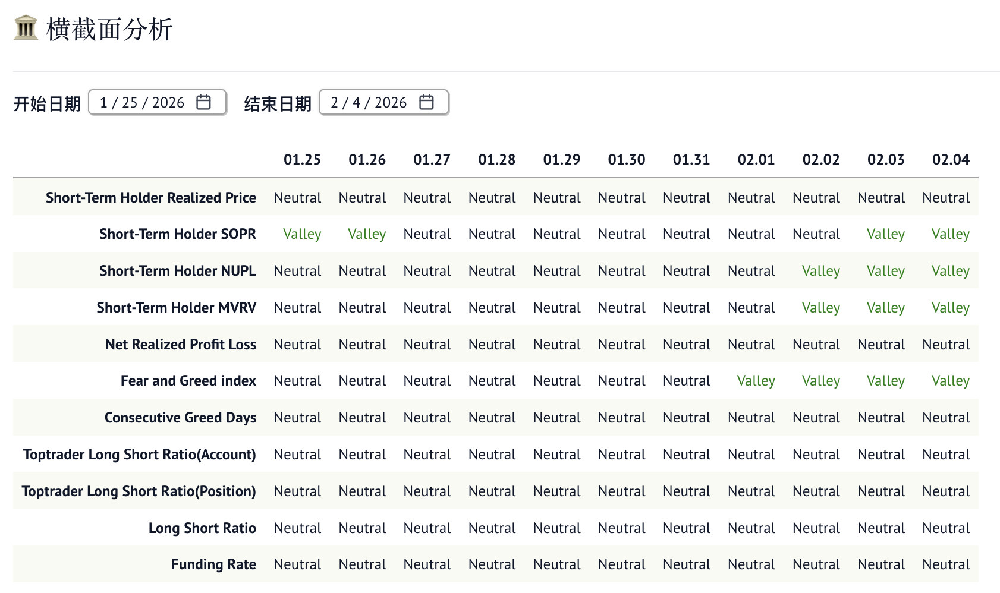
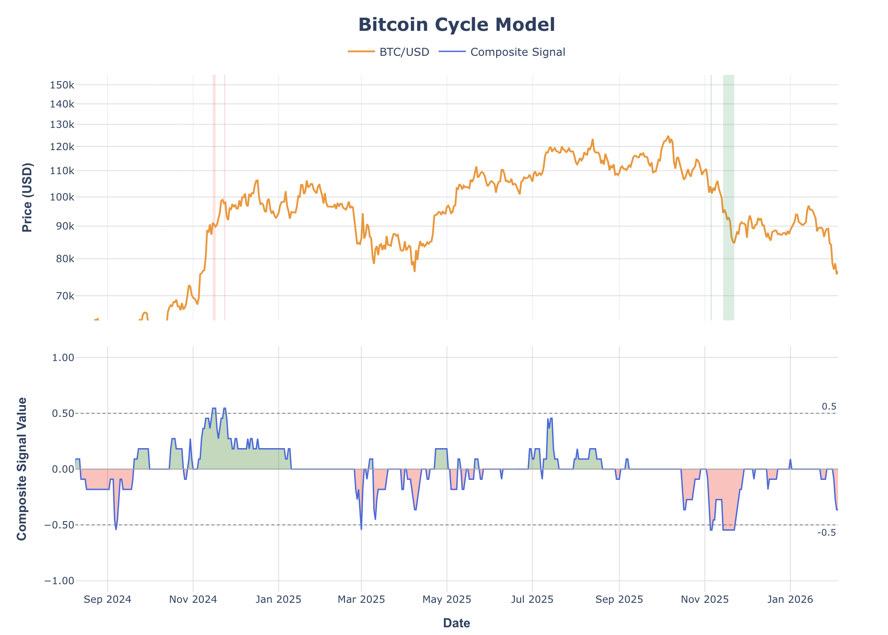

# 比特币周期模型

## 📈 项目简介
这是一个基于 Python 开发的比特币周期分析模型与量化分析系统。该项目旨在通过整合**链上数据（On-chain Metrics）**、**市场情绪指标**以及**价格行为**，构建一个多维度的市场周期识别工具。系统能够自动抓取多源数据，计算复杂的量化指标，并通过交互式可视化界面展示市场的高低点信号，为交易决策提供数据支撑。

## 🚀 核心内容

### 1. 数据工程
- **多源数据集成**：构建了自动化的数据采集管线，支持从 Yahoo Finance (价格)、Binance API (合约持仓、资金费率)、BGeometrics (链上指标)、Alternative.me (情绪指数) 等平台实时同步数据。
- **健壮性设计**：利用 `tenacity` 实现重试机制，确保数据抓取的稳定性；使用 `rich` 库构建友好的命令行交互界面。

### 2. 信号生成
- **链上指标建模**：实现了多种经典的链上分析模型，包括 **STH-MVRV**、**STH-SOPR**、**STH-NUPL**、**NRPL**、**RHODL Ratio** 等。
- **信号工程**：结合**动态百分位通道 (Percentile Bands)** 与**低通滤波 (Lowpass Filter)** 算法，对原始指标进行降噪处理，生成更具参考价值的超买超卖信号。
- **高级数学算子**：在 `indicators.py` 中实现了 **Market Meanness Index (MMI)**、**分形维度 (Fractal Dimension)**、**Super Smoother** 及 **Fisher Transform** 等高级信号处理算法。

### 3. 系统架构
- **面向对象设计**：采用抽象基类 `Metric` 定义指标规范，确保了系统的高度可扩展性。新增指标只需继承基类并实现信号逻辑，即可自动获得绘图和数据验证功能。
- **模块化解耦**：将数据下载 (`downloader`)、信号计算 (`signals`) 与展示层 (`app.py`) 彻底分离，符合工业级软件开发标准。

### 4. 交互式可视化
- **响应式看板**：利用 **Marimo** 打造了响应式的量化分析看板，支持实时参数调整。
- **专业级图表**：使用 **Plotly** 构建交互式双轴图表，支持对数坐标、信号背景区域标注（Peak/Valley）以及多指标对比分析。

## 🛠️ 技术栈
- **语言**: Python 3.13+ (利用最新语法特性)
- **数据处理**: Pandas, NumPy
- **可视化**: Plotly, Matplotlib
- **交互式环境**: Marimo (Reactive Notebook)
- **数据源**: yfinance, Binance API, BGeometrics
- **依赖管理**: UV

## 📊 核心指标说明
项目涵盖了多个维度的量化指标：
- **链上成本分析**: 通过 STH (短期持有者) 的已实现价格和利润率识别市场顶部与底部。
- **市场情绪与流动性**: 整合恐惧贪婪指数、资金费率 (Funding Rate) 及多空比 (LSR) 监控市场杠杆偏好。
- **周期性指标**: 利用 RHODL Ratio 等指标捕捉筹码从长期持有者向短期持有者转移的周期性特征。

## 📂 项目结构
```text
bitcoin-cycle-model/
├── src/
│   ├── downloader/       # 数据采集模块 (Binance, Yahoo, BGeometrics)
│   ├── signals/          # 核心信号逻辑与指标算法
│   │   ├── base.py       # 指标抽象基类
│   │   ├── indicators.py # 高级量化算子 (MMI, Smoother, etc.)
│   │   └── ...           # 具体指标实现 (MVRV, SOPR, etc.)
├── data/                 # 结构化 CSV 数据存储
├── notebooks/            # 策略研究与实验脚本
├── app.py                # Marimo 交互式看板入口
└── download_data.py      # 一键数据同步脚本

🚦 快速开始
1. **安装依赖**:
   ```bash
   uv sync
   ```
2. **同步数据**:
   ```bash
   python download_data.py
   ```
3. **启动看板**:
   ```bash
   marimo run app.py
   ```




